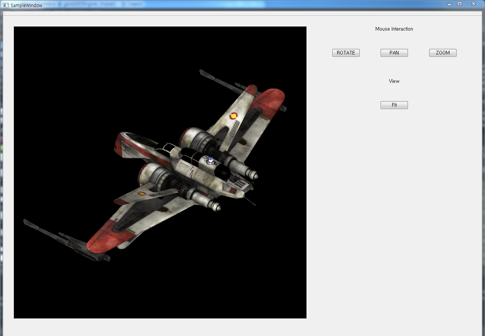

# gengine
##### It is engine based on OpenGL and Qt to develop 3D Graphics on desktop.                                                                              

## Environment
#### Framework and library
##### - OpenGL : over 2.1
##### - Qt : 5.10.1

## Supported Functions

#### Ligthing
##### - Lighting is applied to mesh by phong lighting model to express light effect. FLAT and GOURAUD can be used.

#### Camera
##### - There are two type of camera as Perspective and orthographic.

#### Shape
##### - Some shapes as line, spline, circle, sphere, cylinder, cone are supported.

#### Interaction
##### - Some events as rotation, panning, zomming by mouse is supported in view. The rotation event is by orbit camera. 

## Examples
##### To use examples, gandis 3D engine must be built on QT and OpenGL environment. Each example shows on 'SampleWindow' like as below.
#### SampleWindow

